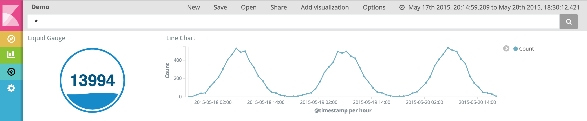

# Kibana Liquid Gauge Plugin

This is a Liquid Gauge visType for Kibana. This plugin is based on this awesome
[d3 visualization](http://bl.ocks.org/brattonc/5e5ce9beee483220e2f6) by brattonc.



##Installation Steps

You can install this plugin and begin playing around with it by copying it into
your $KIBANA_HOME/src/plugins directory.

```
cd $KIBANA_HOME/src/plugins
git clone https://github.com/jeromefroe/kbn_liquid_gauge.git
```

## Future Improvements

Some improvements I'd like to make in the future include

1. Add label (e.g. Count or Average below liquid_gauge)
2. Expose more configuration variables to user in the options tab to allow for further customization
3. Allow the user to select more than metric at a time
